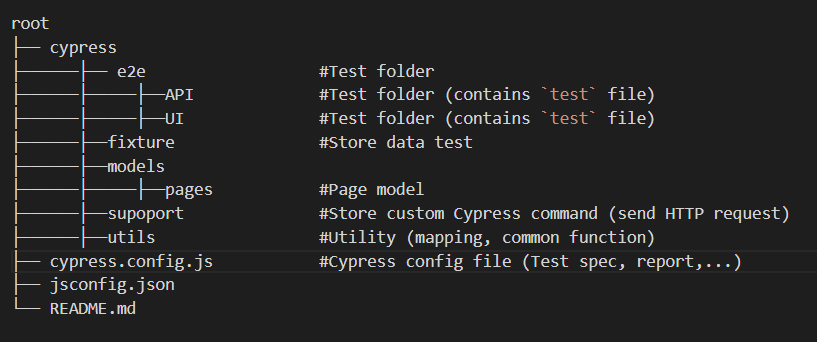

## 🧠 Cypress workspace

This workspace to run E2E test for API and UI - MARSAIR challenge

### 🛠️ **Installation**

1. Clone the repository

`git clone `

2. Install Cypress and dependencies

`npm install`

### 🏃‍♂️ **Running the tests**

1. Run all test file in local

`npm run cy:run`

2. Run individual specific file in Chrome browser

`npm run cy:ui:chrome`

### 👨‍🌾 **Project structure**

